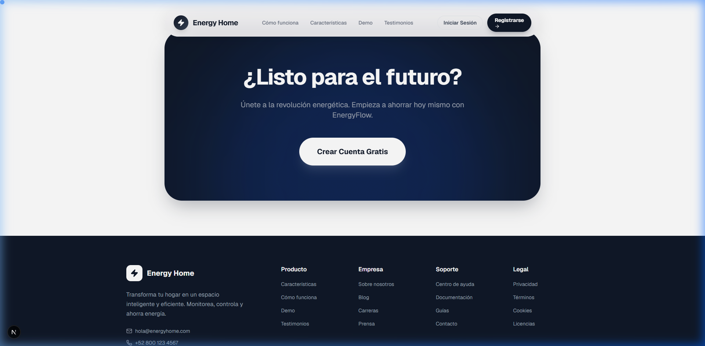
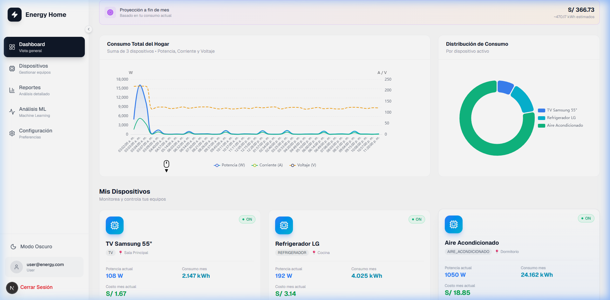
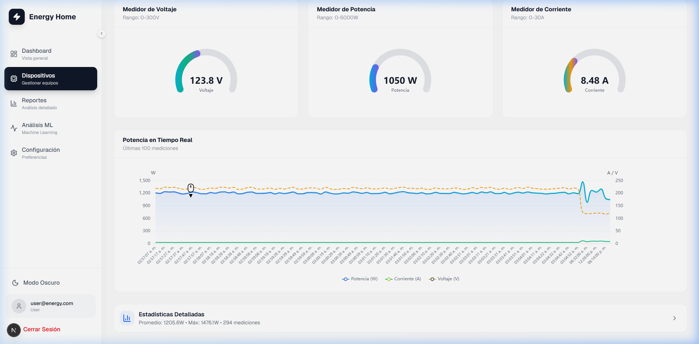
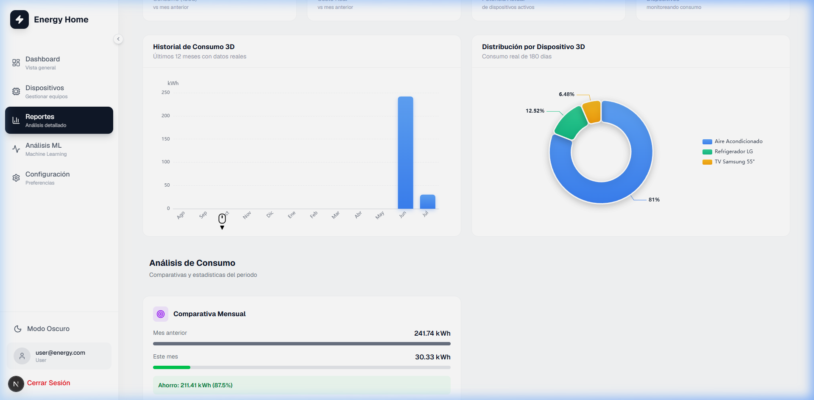
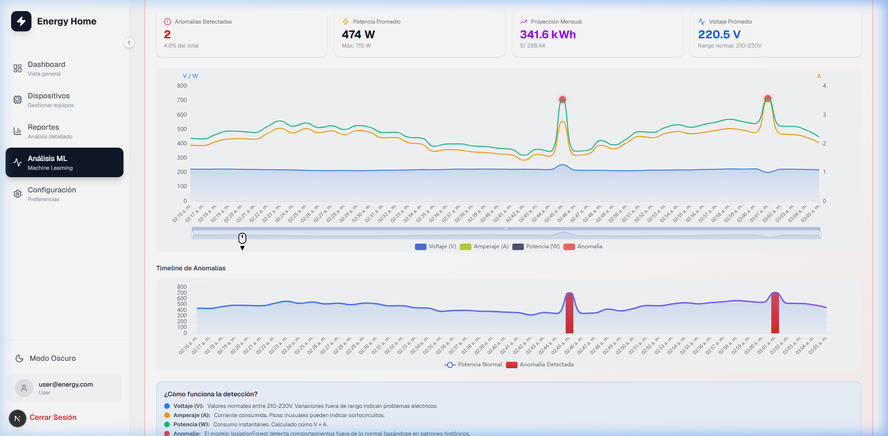
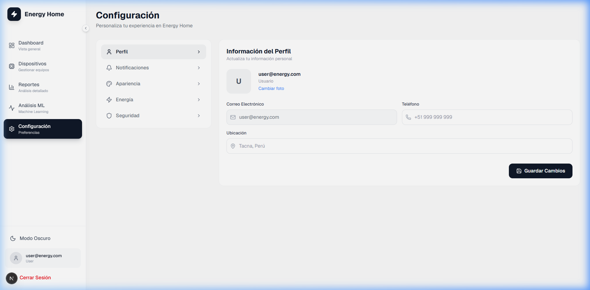
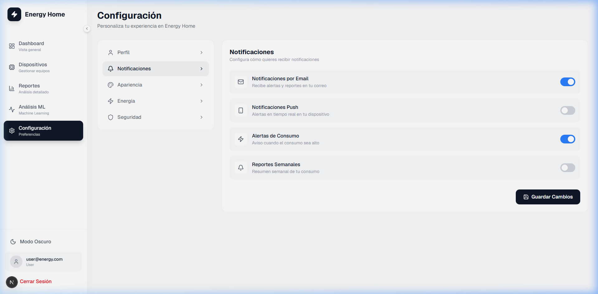
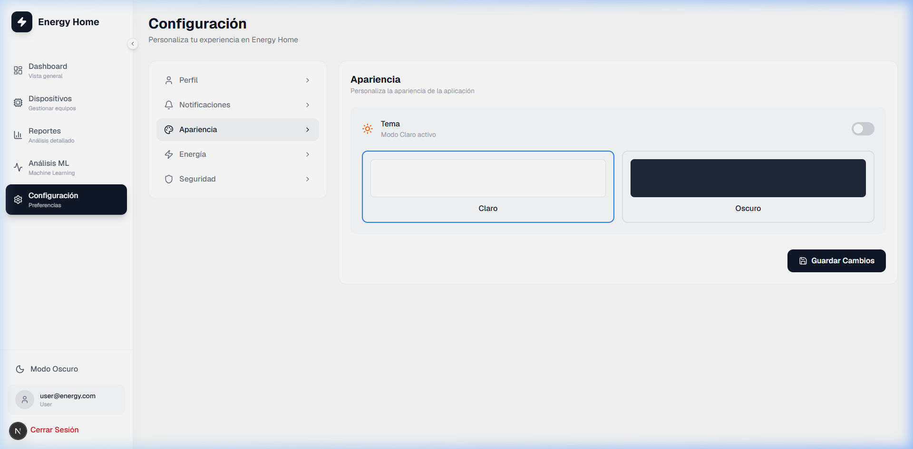
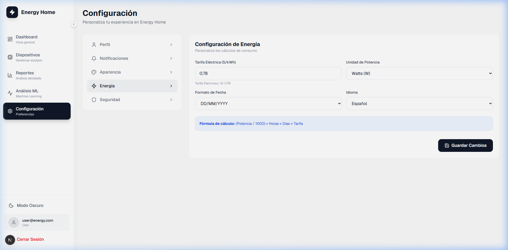

<div align="center">
  <a href="https://github.com/DIMFLIX-EDUCATION" target="_blank">
    
  </a>
  <br />
  <br />
  <a href="https://git.io/typing-svg"></a>
</div>

<div align="center">
  <a href="#about">Acerca de</a> • <a href="#flow">Recorrido</a> • <a href="#architecture">Arquitectura</a> • <a href="#setup">Instalación</a> • <a href="#credentials">Credenciales</a>
</div>

<br />

<div align="center">


</div>

<br />

<div align="center">
  
</div>

---

<a name="about"></a>

## ⚡ Acerca de Energy Home

Energy Home es una plataforma web inteligente diseñada para el **monitoreo, análisis y control del consumo eléctrico** residencial en tiempo real. Utilizando un ecosistema de microservicios, el sistema procesa telemetría enviada por hardware simulado (ESP32) para calcular costos proyectados, detectar anomalías y sugerir patrones óptimos de consumo eléctrico.

```javascript
const ProyectoEnergyHome = {
    tipo: "IoT + Plataforma de Monitoreo Energético",
    tecnologias: {
        frontend: ["Next.js (React 19)", "TailwindCSS", "Framer Motion", "ECharts"],
        backend: ["NestJS (TypeScript)", "Prisma ORM", "WebSockets"],
        baseDatos: ["MySQL Server 8.x/9.x"],
        simulador: ["Python 3", "Requests library"]
    },
    caracteristicasClave: [
        "Monitoreo de Potencia (W), Voltaje (V) y Amperaje (A)",
        "Tarifación dinámica en soles (S/ 0.78 kWh - Electrosur)",
        "Gráficos históricos interactivos con descarga en PDF",
        "Control remoto simulado de encendido/apagado",
        "Detección inteligente de anomalías en consumo"
    ]
};
```

---

<a name="flow"></a>

## 📊 Flujo Paso a Paso de la Plataforma

### 🏠 1. Página de Inicio (Landing Page)
La página principal presenta el producto, sus beneficios, la propuesta de valor y las características principales de ahorro inteligente de energía.



---

### 📈 2. Panel Principal (Dashboard)
Una vez iniciada la sesión, el usuario ingresa al panel principal. Las tarjetas de consumo (Watts, costo, voltaje) se actualizan dinámicamente cada 5 segundos mediante la telemetría del simulador ESP32.



---

### 📺 3. Detalle de Consumo por Equipo
En la sección **Dispositivos**, al seleccionar un equipo como el **Aire Acondicionado**, se abre una vista dedicada que desglosa su potencia, voltaje promedio y el histórico de mediciones enviadas por el hardware en tiempo real.



---

### 📊 4. Reportes con Filtro de Tiempo
La pestaña de **Reportes** consolida estadísticas avanzadas con gráficos mensuales interactivos y un gráfico de distribución de consumo. Incluye filtros funcionales para lapsos de **3 Meses** y **6 Meses** y exportación de datos.



---

### 🧠 5. Análisis e Histórico ML
Visualiza el análisis predictivo de consumo. La plataforma grafica los picos y detecta automáticamente anomalías en la telemetría mediante algoritmos inteligentes, calculando costos e indicando recomendaciones detalladas.



---

### ⚙️ 6. Configuración de Cuenta (Pestañas)
Un panel completo de personalización dividido en 5 categorías navegables para el usuario:

* **Perfil de Usuario:** Información personal y de contacto.
* **Notificaciones:** Configuración de alertas de consumo.
* **Apariencia:** Alternancia entre tema Claro y Oscuro.
* **Energía:** Configuración de umbrales límite de potencia.
* **Seguridad:** Modificación de accesos y credenciales.

<div align="center">
<table>
  <tr>
    <td><b>Perfil</b></td>
    <td><b>Notificaciones</b></td>
  </tr>
  <tr>
    <td></td>
    <td></td>
  </tr>
  <tr>
    <td><b>Apariencia</b></td>
    <td><b>Energía</b></td>
  </tr>
  <tr>
    <td></td>
    <td></td>
  </tr>
</table>
</div>

---

<a name="architecture"></a>

## 🛠️ Arquitectura del Sistema

El flujo de información se despliega de la siguiente manera:

```
┌─────────────────────────────────┐
│     Simulador ESP32 (Python)    │
│  (Envía telemetría cada 5 seg)  │
└────────────────┬────────────────┘
                 │ (HTTP POST JSON)
                 ▼
┌─────────────────────────────────┐      Reads/Writes      ┌─────────────────────────┐
│     Backend API (NestJS)        ├───────────────────────>│   Base de Datos (MySQL) │
│   (Swagger, Prisma ORM, WS)     │                        └─────────────────────────┘
└────────────────▲────────────────┘
                 │ (REST API & WebSockets)
                 │
┌────────────────┴────────────────┐
│     Frontend Web (Next.js)      │
│  (Framer Motion, Charts, UI/UX) │
└─────────────────────────────────┘
```

---

<a name="setup"></a>

## 🚀 Guía de Instalación y Arranque Rápido

### Paso 1: Configurar el Backend (NestJS)
1. Entra a la carpeta del backend:
   ```bash
   cd backend-energy
   ```
2. Asegúrate de configurar tu `.env`. Debe apuntar a tu base de datos MySQL local en el puerto `3306`:
   ```env
   DATABASE_URL="mysql://root@localhost:3306/energy_db"
   PORT=3000
   ```
3. Instala dependencias y prepara Prisma:
   ```bash
   npm install
   npx prisma migrate dev
   npx prisma db seed
   ```
   *La base de datos MySQL se configurará e importará automáticamente.*

4. Inicia el servidor:
   ```bash
   npm run start:dev
   ```

### Paso 2: Configurar el Frontend (Next.js)
1. Ve a la carpeta del frontend:
   ```bash
   cd ../energy
   ```
2. Instala dependencias:
   ```bash
   npm install
   ```
3. Inicia el servidor Next.js:
   ```bash
   npm run dev
   ```
   *El frontend web estará disponible en: `http://localhost:3001`*

### Paso 3: Lanzar el Simulador ESP32
1. En la raíz del proyecto, instala la librería `requests`:
   ```bash
   pip install requests
   ```
2. Ejecuta el script de simulación:
   ```bash
   python simulador_esp32.py
   ```

---

<a name="credentials"></a>

## 🔑 Credenciales de Prueba (Seed)

| Usuario | Password | Rol |
| :--- | :--- | :--- |
| **admin@energy.com** | `123456` | Administrador |
| **user@energy.com** | `123456` | Usuario Regular |
